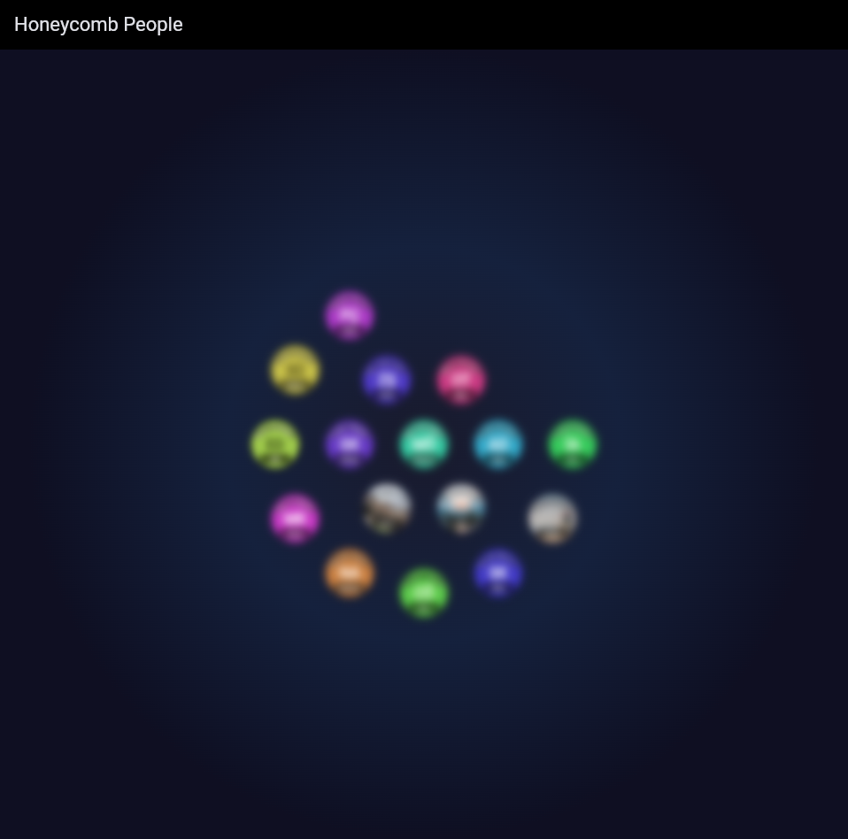

# 🍯 Honeycomb People Core

A Flutter 📦 package to create an interactive, Apple Watch-like bubble view for displaying contributors, team members, or any group of people. The layout is based on a hexagonal grid that dynamically scales and blurs based on the user's focus, providing a smooth and engaging user experience.

[](screen.mp4)
*Click the image above to watch the video*

## ✨ Features

- **Interactive Bubble Layout:** Displays people in a hexagonal grid of circular bubbles.
- **Dynamic Scaling & Blur:** Bubbles scale up and come into focus when hovered over or when the user's pointer is near.
- **Highly Customizable:** Easily configure bubble sizes, spacing, animation properties, and more.
- **Fallback Avatars:** Automatically generates initials and a colored background for contributors without a photo.
- **Extensible:** Use the provided data model or extend it to fit your needs.

## 🚀 Getting started

Add the package to your `pubspec.yaml`:

```yaml
dependencies:
  honeycomb_people_core: ^0.0.1 # Check for the latest version
```

Then, import the package in your Dart code:

```dart
import 'package:honeycomb_people_core/honeycomb_people_core.dart';
```

## 🛠️ Usage

Create a list of `Contributor` objects and pass them to the `ContributorsScreen` widget.

```dart
import 'package:flutter/material.dart';
import 'package:honeycomb_people_core/honeycomb_people_core.dart';

void main() {
  runApp(const MyApp());
}

class MyApp extends StatelessWidget {
  const MyApp({super.key});

  @override
  Widget build(BuildContext context) {
    return MaterialApp(
      home: Scaffold(
        appBar: AppBar(
          title: const Text('Our Team'),
        ),
        body: const ContributorsScreen(
          contributors: [
            Contributor(
              name: "John Doe",
              role: "Flutter Developer",
              photoUrl: "https://example.com/johndoe.png",
            ),
            Contributor(
              name: "Jane Smith",
              role: "UI/UX Designer",
              // photoUrl can be null
            ),
            // ... more contributors
          ],
        ),
      ),
    );
  }
}
```

## ⚙️ Customization

You can customize the appearance and behavior of the honeycomb grid by passing a `HoneycombConfig` object to the `ContributorsScreen` widget.

For example, to change the base bubble size and hover effect:

```dart
ContributorsScreen(
  contributors: myContributors,
  config: const HoneycombConfig(
    baseBubbleSize: 100.0,
    hoverScaleBoost: 1.2,
    maxRings: 5,
  ),
)
```

**Available Properties:**

- `baseBubbleSize`: The default size of the bubbles.
- `maxBubbleSize`: The maximum size a bubble can scale to.
- `minBubbleSize`: The minimum size a bubble can scale to.
- `falloffRadius`: The distance at which the scaling effect starts.
- `hoverScaleBoost`: An additional scaling boost for the hovered bubble.
- `hexSpacing`: The spacing between bubbles in the hexagonal grid.
- And many more for animations, text styles, and backgrounds.

## 📄 License

This package is licensed under the MIT License. You are free to use, modify, and distribute it, provided you give proper credit. See the [LICENSE](LICENSE) file for details.